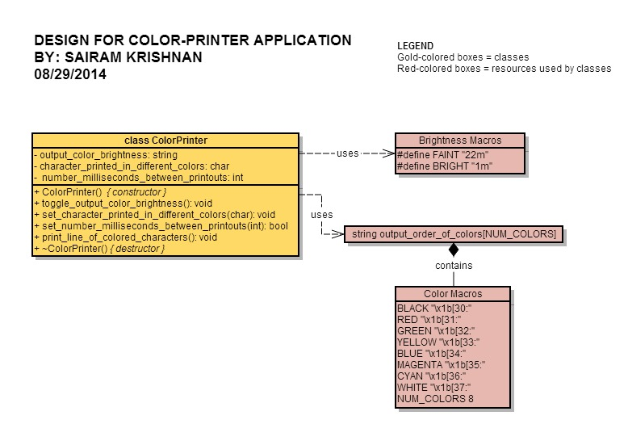

Requirements
===================

R1.	The program shall print out lines of colored characters to the console.

       R1.1. 	Each line shall contain the following colors (not necessarily in the given order):
				* black
				* red
				* green
				* magenta
				* yellow
				* blue
				* cyan
				* gray

        R1.2. 	The brightness of the lines shall alternate between low and high-intensity.

R2.	One of the program's command-line arguments should be a positive integer
	representing the number of milliseconds that we have to wait before the next
	colored character is printed out.

	R2.1.	If no value is specified, then the program shall use a default value of
			1000 milliseconds.

	R2.2.	If an invalid value is specified, then the program shall print an error message
			and use the default value of 1000 milliseconds.

R3.	Another command-line argument should be the character that the user wants to print
	out in different colors within each line.

	R3.1.	If no value is specified, then the program shall use a default value of '*'.

	R3.2.	If a string is specified, then the program shall use the first character of that string.

R4.	All tasks shall take place within a cyclic executive in the main function.

Design
===================

Requirements - Implementation Traceability
=============================================
<table>
   <th> Requirement </th>
   <th> Line(s) of Code </th>
  
   <tr>
     <td> R1.1 </td>
     <td> color_printer.cpp:93 </td>
   </tr>

  <tr>
     <td> R1.2 </td>
     <td> main.cpp:76 </td>
   </tr>

  <tr>
     <td> R2.1 </td>
     <td> color_printer.cpp:26 </td>
   </tr>

  <tr>
     <td> R2.2 </td>
     <td> color_printer.cpp:64, main.cpp:38 </td>
   </tr>

  <tr>
     <td> R3.1 </td>
     <td> color_printer.cpp:29 </td>
   </tr>

  <tr>
     <td> R3.2 </td>
     <td> main.cpp:47 </td>
   </tr>

  <tr>
     <td> R4 </td>
     <td>main.cpp:72  </td>
   </tr>
</table>
